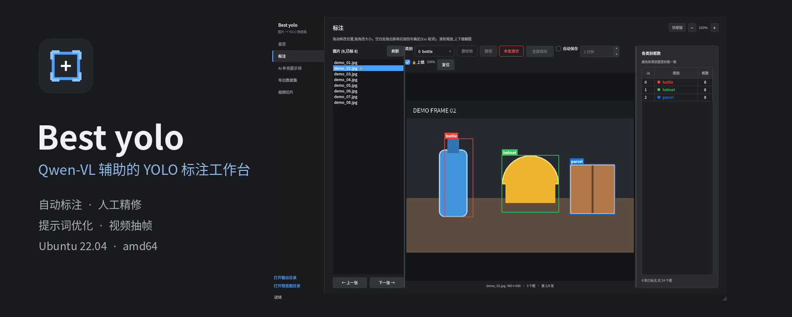

<div align="center">
  
  <h1>Best yolo</h1>
  <p><strong>A desktop workflow from images or video to a reviewed YOLO dataset.</strong></p>

  [](https://github.com/LIANGFENG1007/best-yolo/actions/workflows/ci.yml)
  [](https://github.com/LIANGFENG1007/best-yolo/releases/latest)
  

  [Download](https://github.com/LIANGFENG1007/best-yolo/releases/latest) ·
  [中文](README.md)
</div>



Best yolo combines Qwen-VL assisted auto-labeling, manual bounding-box correction, prompt refinement from human edits, video frame extraction, and YOLO dataset export in one PySide6 desktop app.

## Highlights

- Preview a small batch before paying for a full API run.
- Rate limiting, retries, tiled detection, coordinate validation, and failed-image recovery.
- Edit normalized YOLO boxes directly on the original image with undo/redo and image locks.
- Compare the AI baseline with human corrections and selectively apply prompt suggestions.
- Extract a selected video interval and export deterministic train/validation splits.
- Configure 77 commands through a searchable shortcut editor.

## Install on Ubuntu 22.04 amd64

Download the `.deb` from [Releases](https://github.com/LIANGFENG1007/best-yolo/releases/latest), then run:

```bash
sudo apt install ./best-yolo_*_amd64.deb
```

Launch **Best yolo** from the application menu. The release bundles its Python runtime dependencies. Access to Ubuntu repositories may be required to install missing system GUI libraries.

The public package is the cloud API edition. GPU-specific PyTorch, CUDA, local model weights, and training dependencies remain optional source installations. See [development](docs/development.md), [privacy](docs/privacy.md), and [troubleshooting](docs/troubleshooting.md).

## License status

No open-source license has been granted yet. The source is visible for inspection and personal evaluation; redistribution and modification rights are reserved until a license is selected.
