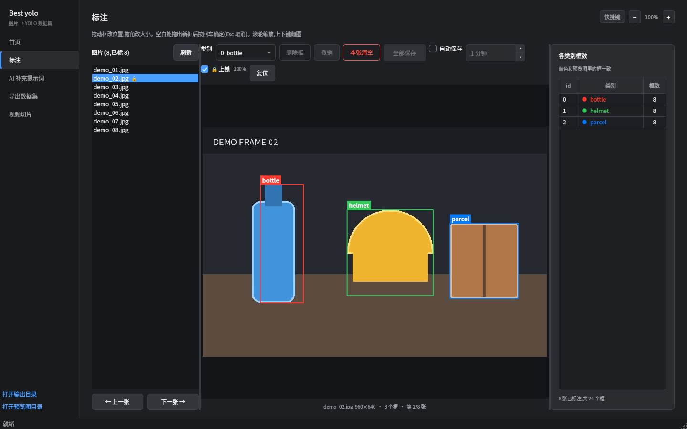
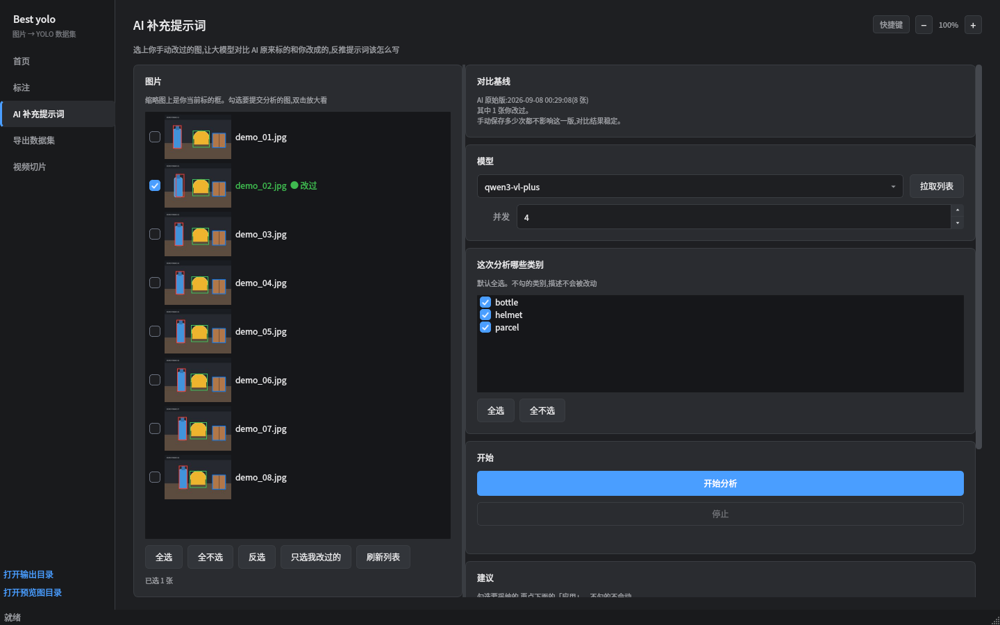
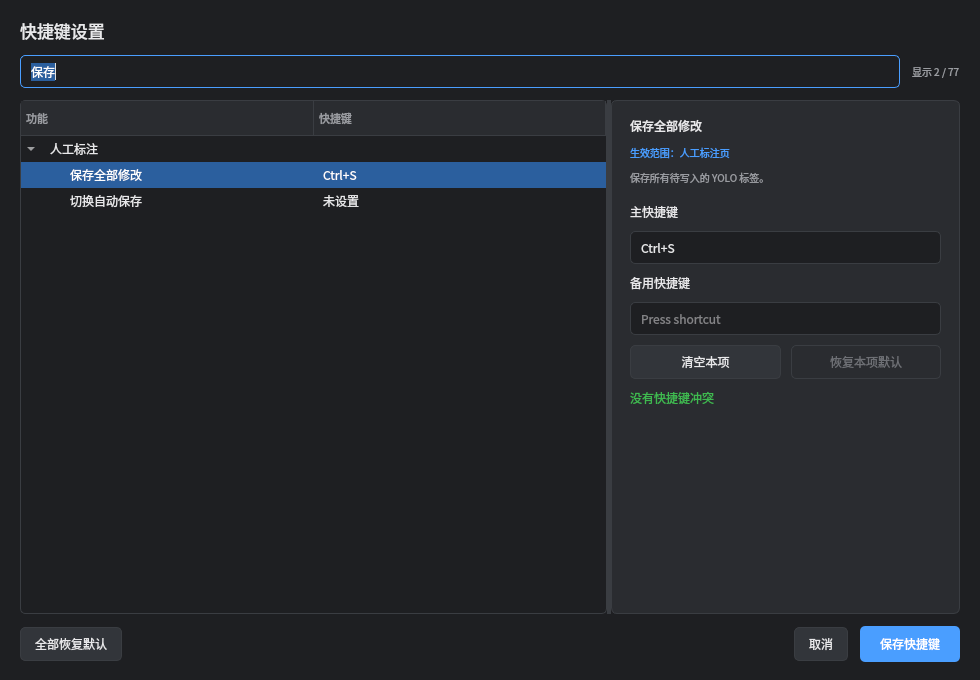
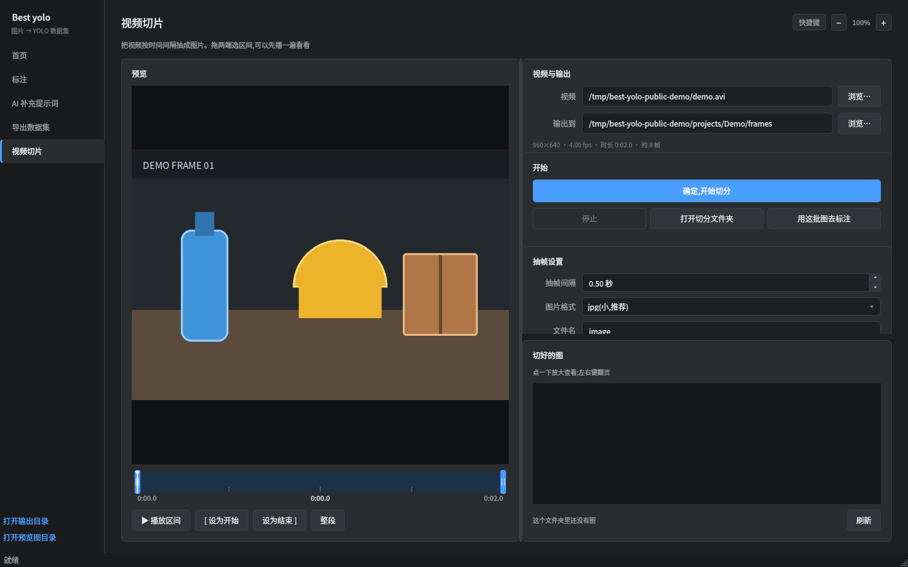
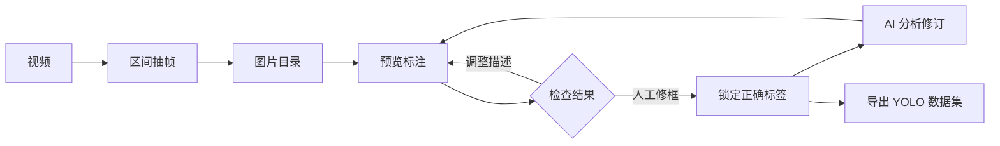

<div align="center">
  
  <h1>Best yolo</h1>
  <p><strong>从图片或视频到 YOLO 数据集的一站式桌面标注工作台</strong></p>
  <p>Qwen-VL 自动打框 · 人工精修 · AI 反推提示词 · 视频抽帧 · 数据集导出</p>

  [](https://github.com/LIANGFENG1007/best-yolo/actions/workflows/ci.yml)
  [](https://github.com/LIANGFENG1007/best-yolo/releases/latest)
  
  
  

  [下载最新版](https://github.com/LIANGFENG1007/best-yolo/releases/latest) ·
  [安装文档](docs/installation.md) ·
  [English](README.en.md)
</div>


## 它解决什么问题

视觉模型能快速产生第一版检测框，但真正可训练的数据集还需要检查漏标、误标、类别串标、坐标偏移和负样本。Best yolo 把这条流程放进一个桌面应用：先用兼容 OpenAI 接口的 Qwen-VL 模型批量标注，再直接在原图上修框，最后导出标准 YOLO 数据集。

## 核心能力

| 板块 | 能力 |
|---|---|
| 自动标注 | 预览小批量后再跑全量；支持并发、QPS、重试、切片检测和坐标口径检查 |
| 人工标注 | 新建、移动、缩放、改类、删除框；撤销/重做、自动保存、图片锁定和缩放平移 |
| AI 补充提示词 | 对比“AI 原始版”和人工修订版，逐图分析后生成可选择采纳的类别描述建议 |
| 视频切片 | 可视化选择时间区间，按时间间隔抽帧，支持续编序号和缩略图检查 |
| 数据集导出 | 配对图片与标签，稳定切分 train/val，生成 `data.yaml` 和 `classes.txt` |
| 快捷键 | 77 个命令可配置，按页面分组，支持主/备用按键、包含搜索和冲突检查 |

<table>
  <tr>
    <td width="50%"></td>
    <td width="50%"></td>
  </tr>
  <tr>
    <td align="center">在原图上精修 YOLO 框</td>
    <td align="center">从人工修订反推提示词</td>
  </tr>
  <tr>
    <td width="50%"></td>
    <td width="50%"></td>
  </tr>
  <tr>
    <td align="center">按功能板块管理快捷键</td>
    <td align="center">选区间并批量抽帧</td>
  </tr>
</table>

## Ubuntu 22.04 安装

从 [Releases](https://github.com/LIANGFENG1007/best-yolo/releases/latest) 下载最新的 `amd64.deb`，然后在下载目录运行：

```bash
sudo apt install ./best-yolo_*_amd64.deb
```

安装完成后在应用菜单搜索 **Best yolo**，或运行：

```bash
best-yolo
```

发布版面向 Ubuntu 22.04 x86_64，内置 PySide6、OpenAI SDK、Pillow、OpenCV、NumPy 和 PyYAML。首次安装缺少系统图形库时，`apt` 会从 Ubuntu 软件源补齐。详细说明见 [安装文档](docs/installation.md)。

## 工作流程



## 数据与隐私

- Release 不包含任何 API Key、项目图片、标签或个人路径。
- API Key 只保存在当前用户的 `~/.local/share/best-yolo/.gui_state.json`，权限为 `600`。
- 只有用户主动开始云端标注或提示词分析时，选中的图片才会发送到所配置的 API 接入点。
- 卸载软件不会删除用户项目；完整说明见 [隐私与数据](docs/privacy.md)。

## 从源码运行

```bash
git clone git@github.com:LIANGFENG1007/best-yolo.git
cd best-yolo
./scripts/bootstrap.sh
./scripts/run-dev.sh
```

本地 Qwen-VL 后端和 YOLO 训练是可选组件，分别参见 [开发文档](docs/development.md)。

## 系统诊断

```bash
best-yolo --diagnose
best-yolo --show-log
```

常见问题见 [故障排查](docs/troubleshooting.md)。提交问题前请删除日志中的接入点和文件路径，不要上传 `.gui_state.json`。

## 项目状态

当前 Release 是云端 API 版。PyTorch、CUDA、本地模型权重和训练环境与显卡及驱动强绑定，因此不塞进通用 `.deb`；源码仍保留这些可选入口。

## 许可证

当前仓库尚未附加开源许可证。源码公开用于查看和个人评估；这不自动授予复制、修改或重新分发源码的权利。Release 二进制可供下载安装。正式开源授权将在后续版本中单独确定。
